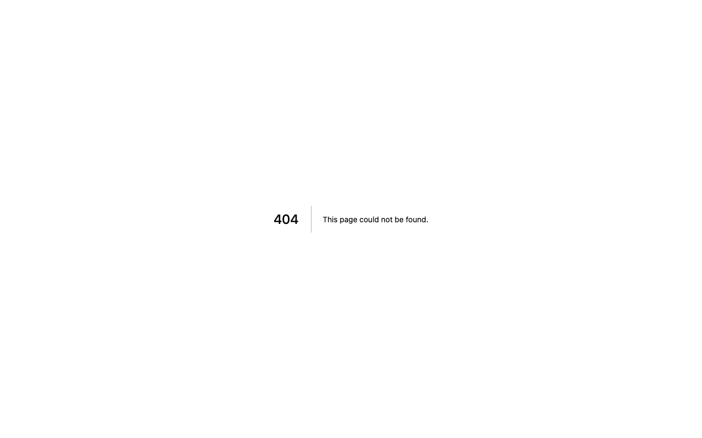

# Isla Garden Portfolio

Site pessoal **bilíngue** (`pt` / `en`) com identidade visual “jardim”, **paletas de cor alternáveis** guardadas no browser e secções que vão além da típica grelha de projetos: **sobre**, **criações**, **aulas**, **tecnologias**, **contacto** e **definições**. Construído com **Next.js (App Router)**, **React**, **TypeScript**, **Tailwind CSS v4** e **Framer Motion** para transições leves.

Repositório relacionado: [https://github.com/alesandraisla/isla-portfolio](https://github.com/alesandraisla/isla-portfolio)

## Pré-visualização

_Capturas geradas em ambiente local (`/pt`)._

| Início | Sobre |
| --- | --- |
|  |  |

| Definições (paletas) |
| --- |
|  |

## Tecnologias

- **Next.js** 16 (App Router), **React** 19, **TypeScript**
- **Tailwind CSS** 4 + tokens em **variáveis CSS** (`src/styles/theme.css`)
- **Framer Motion** (ex.: `PageTransition`)
- **ESLint** com `eslint-config-next`

## Metodologia e o que destaca o projeto

- **Rotas por idioma** (`/[locale]/...`) com textos centralizados em **`src/i18n/dictionaries.ts`** e validação de locale no layout.
- **Middleware** redireciona URLs sem locale para o idioma por defeito (`pt`).
- **Tema**: várias paletas (`jardim`, `lavanda`, `blossom`, `orchid`) aplicadas via `data-palette` no `documentElement`, com persistência em `localStorage` — não é apenas claro/escuro.
- **Componentes por área** em `src/components/` (about, aulas, contact, creations, layout, motion, providers, settings, technologies).
- **Export estático** (`output: "export"` em `next.config.ts`) e **`basePath: "/isla-portfolio"`** para alojamento em GitHub Pages (imagens `next/image` em modo compatível com o export).

## Estrutura de pastas (resumo)

```
src/
  app/                 # App Router: layout raiz + rotas [locale]
  assets/              # Imagens importadas no bundle
  components/          # UI por domínio
  i18n/                # config + dicionários
  styles/              # globals + tema (CSS variables)
```

## Como correr localmente

```bash
npm install
npm run dev
```

Abre [http://localhost:3000](http://localhost:3000) — o site redireciona para **`/pt`**.

## Build de produção (export estático)

```bash
npm run build
```

Gera o site estático na pasta **`out/`** (ignorada pelo Git). Os assets e rotas usam o prefixo configurado em `next.config.ts`: **`basePath: "/isla-portfolio"`** (ex.: ficheiros em `out/` referenciam `/isla-portfolio/_next/...`).

Para pré-visualizar o export localmente (ex.: [serve](https://github.com/vercel/serve)):

```bash
npx serve out
```

Depois abre **`http://localhost:3000/isla-portfolio/pt`** (ajusta porta se o `serve` mostrar outra).

O script `npm run start` corresponde ao servidor **Next** padrão; para GitHub Pages costuma publicar-se o conteúdo de **`out/`** na raiz do site com o caminho do repositório (`/isla-portfolio`).

## Atualizar as imagens deste README

Com o servidor de desenvolvimento a correr (`npm run dev`), na raiz do projeto:

```bash
mkdir -p docs/readme
npx -y playwright@1.49.1 screenshot "http://127.0.0.1:3000/pt" "docs/readme/home-pt.png" --viewport-size=1280,800 --wait-for-timeout=2000
npx -y playwright@1.49.1 screenshot "http://127.0.0.1:3000/pt/about" "docs/readme/about-pt.png" --viewport-size=1280,800 --wait-for-timeout=2000
npx -y playwright@1.49.1 screenshot "http://127.0.0.1:3000/pt/settings" "docs/readme/settings-pt.png" --viewport-size=1280,800 --wait-for-timeout=2000
```

Na primeira utilização o Playwright pode pedir a instalação do Chromium (`npx playwright install chromium`).
